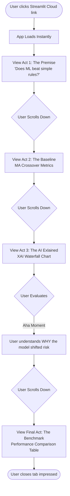
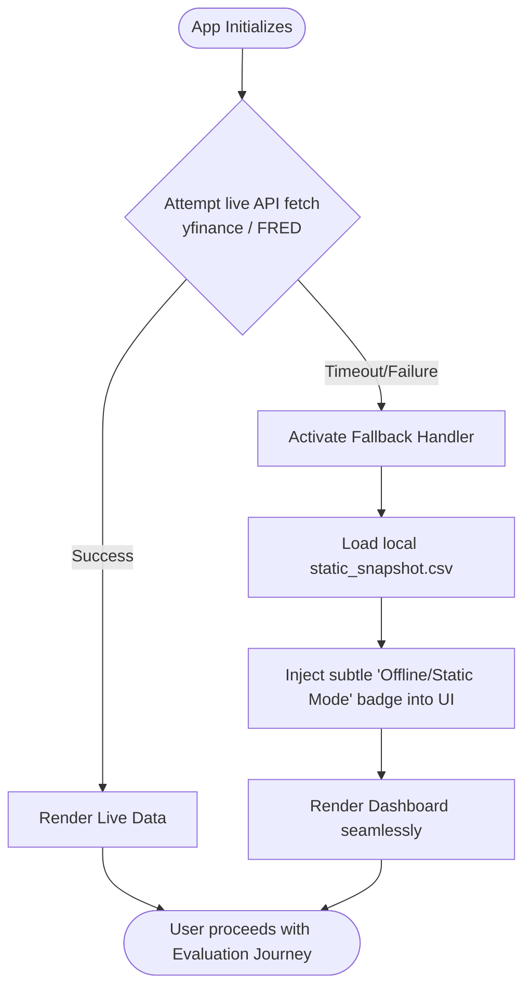

# UX Design Specification green-rock

**Author:** Andrey
**Date:** 2026-03-30

---

<!-- UX design content will be appended sequentially through collaborative workflow steps -->

## Executive Summary

### Project Vision
green-rock is an Adaptive ETF Portfolio built to answer the question: "Does machine learning actually beat simple rules for market regime detection?" It's an institutional-grade portfolio application focused on transparency and explainability rather than black-box price prediction. It compares a Random Forest AI model against a moving-average baseline to dynamically shift investments across risk regimes, serving as a powerful demonstration of quant abilities for asset management interviews.

### Target Users
- **The Interviewer (Portfolio Managers / Institutional Evaluators):** Time-constrained, highly rigorous, values explainability and scientific process over complex opaque models. 
- **The Builder (Andrey):** Requires a smooth, crash-free presentation environment to confidently talk through the data pipeline and insights.
- **GitHub Visitors (Recruiters / Peers):** Need a one-click demo experience that just works seamlessly on desktop and mobile without complicated setup.

### Key Design Challenges
- **Explaining ML to Non-Technical Users:** Translating complex feature weights and risk boundaries into an intuitive, instantly readable "Waterfall" visualization.
- **Streamlit Constraints:** Achieving a premium, institutional look-and-feel within the layout limitations of a Streamlit single-page app avoiding "clunky" tab re-draws.
- **Data State Transparency:** Clearly communicating when the app is using live API data versus a static CSV fallback to guarantee the demo never crashes.

### Design Opportunities
- **A Single Long-Scrolling Narrative Arc:** Structuring the dashboard vertically to walk the interviewer through the thesis effortlessly, mimicking the flow of an article or scientific paper.
- **Light Classic Theme Authority:** Utilizing a professional light/classic theme resembling institutional software (like a Bloomberg Terminal output) allowing risk metrics (like Red and Green color coding) to instantly stand out on the page without visual clutter.
- **The "Hero" Screenshot:** Crafting a highly shareable, visually impressive Explainable AI (XAI) Risk Attribution Waterfall chart that works perfectly on a mobile phone for recruiter access.

## Core User Experience

### Defining Experience
The core user experience is a frictionless, narrative-driven exploration of an investment thesis. The primary user action is simply vertically scrolling through a single page. It requires zero configuration, no login, and no technical setup. The experience leads the viewer from a familiar baseline (Moving Average) directly into advanced explainability (Random Forest Feature Importance and XAI Risk Attribution) without breaking their flow.

### Platform Strategy
- **Primary Platform:** Web-based Streamlit single-page application deployed via Streamlit Cloud.
- **Cross-Device Focus:** Desktop-first (for deep dives), but critically mobile-friendly since recruiters often click GitHub portfolio links from their phones.
- **Architecture Constraint:** Relies entirely on native browser scrolling; avoids clunky tab interfaces or complex JavaScript state management.

### Effortless Interactions
- **Instant Access:** The dashboard renders with data immediately upon load, without the user having to press a "Run" or "Fetch Data" button.
- **Silent Fallbacks:** If the live yfinance/FRED API fails, the application invisibly falls back to a bundled CSV static snapshot so the demo never hangs or crashes.
- **Visual Glancing:** Risk regimes are universally color-coded (forest green for Low Risk, crimson for High Risk) so the user doesn't even need to read the legend to understand the shifts.

### Critical Success Moments
- **The "Three-Second Hook":** The moment the dashboard loads, the clean, Bloomberg-esque Light Classic theme establishes immediate institutional credibility.
- **The "Aha!" Moment (XAI Waterfall):** When the interviewer sees exactly *why* the Random Forest model weighted a specific decision, proving the builder understands that transparency beats black boxes.
- **The Side-by-Side Proof:** When the final results table clearly compares the baseline vs. the ML model vs. standard 60/40 benchmarking, closing the narrative loop.

### Experience Principles
1. **Scrolling is Storytelling:** Never force a click when a scroll can reveal the next chapter of the thesis.
2. **Transparent Over Clever:** The UX must prioritize explainability of the ML model (answering the "WHY") over flashy animations.
3. **Institutional Density:** Use professional, high-contrast Light Classic aesthetics to signal rigorous analytical capabilities.
4. **Unbreakable Demos:** A portfolio project must never crash in front of an evaluator; fallback mechanisms are a core UX feature.

## Desired Emotional Response

### Primary Emotional Goals
- **Trust & Credibility:** The user should immediately feel they are looking at a serious, institutional-grade analytical tool, not a toy project. 
- **Intellectual Clarity:** They should experience an "Aha!" moment when the ML model's decisions are unpacked and explained simply.
- **Confidence in the Builder:** The ultimate emotional goal is for the interviewer to feel confident that Andrey understands the scientific process, benchmarking, and the importance of transparent AI in finance.

### Emotional Journey Mapping
- **First Impression (Initial Load):** *Intrigue and Respect.* The clean, high-density Light Classic theme immediately commands respect and sets a professional tone.
- **Mid-Scroll (The XAI Waterfall):** *Delight and Clarity.* A moment of pleasant surprise when realizing the ML model is fully transparent, answering the "why" instead of just the "what."
- **Task Completion (Results Table):** *Satisfaction.* The thesis is cleanly resolved side-by-side without requiring the user to hunt for the answer.
- **Error States (API Failure during Demo):** *Relief/Impress.* When live data fails and the CSV fallback kicks in silently, the emotion shifts from potential anxiety to deep appreciation for your engineering foresight.

### Micro-Emotions
- **Trust > Skepticism:** Achieved by prominently displaying data sources, benchmark labels, and the strict MA crossover baseline.
- **Clarity > Confusion:** Achieved by utilizing universally understood color coding (Forest Green, Amber, Crimson) for risk regimes, minimizing cognitive load.

### Design Implications
- **To build Trust:** We will use sharp, easily legible typography with plenty of whitespace, ensuring every axis and data point is clearly labeled.
- **To create Delight (The "Aha!" moment):** We will dedicate the largest portion of our visual hierarchy to the Feature Importance and Waterfall charts, ensuring they naturally draw the eye.
- **To prevent Frustration:** Interactions should be zero-setup. The user explores the entire thesis simply by scrolling, completely removing the frustration of clicking through unfamiliar tabs.

### Emotional Design Principles
1. **Transparency Builds Trust:** Give the user the exact features that drove the decision; never hide behind the "black box."
2. **Professionalism First:** The aesthetic should always mirror the seriousness of institutional finance. 
3. **Resilience Creates Confidence:** Fallbacks must be invisible and seamless so the user never experiences the friction of a broken app.

## UX Pattern Analysis & Inspiration

### Inspiring Products Analysis
1. **Institutional Dashboards (Bloomberg Terminal / BlackRock Aladdin):**
   - *Why they work:* They prioritize extremely high data density over modern "fluff." They use sharp fonts, stark contrasts, and absolute clarity.
   - *What to take:* The professional, unassailable authority of a no-nonsense aesthetic.
2. **Interactive Data Journalism (NYT Upshot / The Pudding):**
   - *Why they work:* They don't just show data; they tell a story sequentially. As you scroll, the thesis is proven step-by-step.
   - *What to take:* The "scrollable narrative" layout rather than a generic grid dashboard.
3. **Best-in-Class Technical Pitch Decks:**
   - *Why they work:* They have strong visual hierarchy. They state the problem clearly, show the baseline, and then hit you with a massive "Hero" visual (in our case, the XAI Waterfall).

### Transferable UX Patterns
- **The "Pitch Deck" Scroll:** A single-column or strictly ordered vertical layout that forces the viewer to process the narrative in the exact order you intend: Baseline → ML Model → Feature Importance → Final Comparison.
- **Universal Status Colors:** Stripping away complex icons in favor of pure, universally understood color coding (Forest Green = Risk On, Crimson = Risk Off) for instant glancing.
- **Data-Dense Markdown Blocks:** Using deeply formatted but perfectly aligned tables for the final Benchmark results, making the math self-evident.

### Anti-Patterns to Avoid
- **"Dashboard Clutter":** Cramming every single chart into a 2x2 grid at the top of the page. This destroys the storytelling aspect and overwhelms the user.
- **Hidden Complexity (Tabs and Accordions):** In a 5-minute interview demo, if the Random Forest comparison is hidden behind a tab, the interviewer might never see it.
- **The "Black Box" Metric:** Showing an ML prediction line without surrounding it with the feature weights that caused it. Evaluators hate unexplainable AI.

### Design Inspiration Strategy
- **What to Adopt:** The scrolling narrative structure of interactive data journalism to perfectly pace out the baseline-vs-ML comparison.
- **What to Adapt:** Streamlit's native components, tightening up margin/padding spacing via light CSS injection to make them feel less "default" and more "institutional."
- **What to Avoid:** Tabbed navigation, hidden menus, and cluttered horizontal alignments. Everything vital must be visible simply by scrolling down.

## Design System Foundation

### 1.1 Design System Choice
**Streamlit Native Theming** (Configuration-driven, Light Classic Theme)

### Rationale for Selection
- **Speed & Stability:** Streamlit’s native components are highly optimized for rendering the dense data charts we need. By relying on native components, we avoid brittle CSS hacks that could break during a live demo or future Streamlit updates.
- **Institutional Consistency:** Streamlit's global theming engine (`config.toml`) allows us to enforce a strict color palette and modern typography across the entire app with just a few lines of configuration.
- **Developer Experience:** Andrey’s focus must remain on the ML algorithms and financial data pipeline, not on managing frontend CSS cascades. 

### Implementation Approach
All visual styling will be centrally managed via a `.streamlit/config.toml` file in the repository. We will globally define:
- `primaryColor` (e.g., a deep slate or authoritative blue)
- `backgroundColor` (e.g., pure white `#FFFFFF` for the Light Classic feel)
- `secondaryBackgroundColor` (e.g., `#F0F2F6` for subtle separation of baseline vs ML metrics)
- `textColor` (e.g., a high-contrast near-black `#262730`)
- `font` (a clean sans-serif like "sans serif" natively supported, mapping to Inter/Roboto)

### Customization Strategy
- **Metric Coloring:** We will adhere to universal financial traffic-light colors applied exclusively to state-changes (Forest Green for Low Risk updates, Crimson for High Risk).
- **Layout Tokens:** We will strictly use native layout containers (`st.columns`, `st.expander` for deep dives, and `st.container` for visual bounding boxes) to create the scrolling Pitch Deck structure without custom HTML.

## 2. Core User Experience Specifics

### 2.1 Defining Experience
The defining experience of green-rock occurs at the precise moment the user scrolls past the simple moving-average baseline and encounters the Explainable AI (XAI) Waterfall chart. It’s the instant transition from "Okay, he built another Random Forest model" to "Wow, he understands exactly why the model is making these decisions." The seamless vertical scroll that drops the user right into visual ML explainability is the project's hero interaction.

### 2.2 User Mental Model
- **The Skeptical Evaluator:** Portfolio Managers and Quants inherently distrust complex ML models. Their mental model equates "Machine Learning" with "Black Box." 
- **The Paradigm Shift:** By using a Waterfall chart—a visualization extremely common in corporate earnings and traditional finance—we map an advanced concept (Random Forest feature contributions) into a mental model the evaluator already completely trusts and understands.

### 2.3 Success Criteria
- **Instant Comprehension:** The user must be able to glance at the XAI Waterfall chart and, within 5 seconds, explicitly state the primary driver for today's risk regime (e.g., "Ah, the yield curve inversion drove the High-Risk flag").
- **Zero-Friction Discovery:** The user never has to click a button, adjust a slider, or run a script to see these insights—they are presented natively on load.
- **Visual Validation:** The performance table at the bottom cleanly proves whether the explicitly explained ML model actually outperformed the simple rules.

### 2.4 Novel UX Patterns
- **XAI via Waterfall:** Using a cumulative waterfall chart for Machine Learning feature attribution is a novel, highly effective UX pattern in this context. While waterfall charts are standard in finance for profit/loss attribution, repurposing them to show *how much each data feature added or subtracted from the total Risk Score* is an innovative bridge between Data Science and Asset Management.

### 2.5 Experience Mechanics
1. **Initiation:** The user opens the Streamlit Cloud link from your resume/LinkedIn. The dashboard auto-fetches data (or falls back to CSV silently) and renders instantly. 
2. **Interaction (The Scroll):** The user scrolls vertically. They see the timeline of market regimes (green/yellow/red bands over the S&P 500 price). 
3. **Feedback (The Reveal):** As they scroll further, they hit the XAI section. The UI immediately highlights the current day's risk score and visually breaks it down via the familiar Waterfall format.
4. **Completion:** The viewer reaches the bottom "Benchmark Table" where the final returns (ML vs. Baseline vs. 60/40) are cleanly laid out. They close the tab confident in your quantitative and presentation skills.

## Visual Design Foundation

### Color System
To achieve the Light Classic, institutional vibe, our color palette actively avoids playful, saturated tech colors in favor of stark, high-contrast, serious tones.
- **Primary Color:** Deep Slate Blue (`#1F3A5F`) — used sparingly for active UI elements to convey trust and stability.
- **Background Color:** Pure White (`#FFFFFF`) — maximizes contrast and legibility for charts and text.
- **Secondary Background Color:** Light Institutional Grey (`#F0F2F6`) — used for metric cards or callout boxes to separate them from the main narrative flow.
- **Text Color:** High-Contrast Charcoal (`#262730`) — softer than pure black to reduce eye strain while maintaining strict readability.
- **Semantic Risk Colors:** 
  - High Risk (Risk Off): Crimson (`#D32F2F`)
  - Low Risk (Risk On): Forest Green (`#388E3C`)
  - Transition/Warning: Amber (`#FBC02D`)

### Typography System
We will utilize Streamlit’s native "sans serif" font family, which maps to clean, highly legible system fonts like Inter or Roboto.
- **Tone:** Professional, analytical, and objective.
- **Hierarchy:** 
  - Very few H1 headers.
  - We rely heavily on H3s for subsection titles to keep the page structurally dense.
  - Body text is kept to standard sizes, with bold weights used specifically to highlight data points in text (e.g., "**+4.2%** over baseline").

### Spacing & Layout Foundation
- **Data Density:** Asset managers are accustomed to Bloomberg Terminal density. We want an efficient layout without excessive "modern" whitespace.
- **Layout Approach:** We will utilize Streamlit’s `layout="wide"` configuration to claim screen real estate, but we will wrap the main narrative in `st.columns` to prevent text lines from becoming unreadably wide on large monitors.
- **Vertical Rhythm:** We will use native Streamlit markdown (`---`) combined with `st.container` to create clear, horizontal boundary lines between the Baseline, ML, and Comparison sections.

### Accessibility Considerations
- **Contrast Check:** The Charcoal (`#262730`) text on Pure White (`#FFFFFF`) guarantees WCAG AAA compliance for readability.
- **Color-Blindness Safe Design:** We will never use color alone to convey risk. "High Risk" must always be accompanied by the text label "High Risk," not just a red icon. The Crimson and Forest Green shades chosen also maintain differing luminosity levels.

## Design Direction Decision

### Design Directions Explored
We generated and reviewed three architectural wireframes for the green-rock UI:
1. **The Standard Grid Dashboard:** A traditional 2x2 grid layout showing metrics side-by-side.
2. **The Pitch Deck Scroll:** A single, strictly ordered vertical column prioritizing storytelling.
3. **The Split Narrative View:** A sticky left sidebar with narrative text and a scrolling right panel for charts.

### Chosen Direction
**Direction 2: The Pitch Deck Scroll (Enhanced)**
We are committing to a full-width, single-column vertical scroll that forces the viewer to process the data exactly in the order intended by the builder without distractions or navigation hurdles. We have enhanced this core decision with strong visual pacing techniques based on UX feedback.

### Design Rationale
- **Storytelling over Surfacing:** The Grid Dashboard treats all charts as equally important, encouraging the user's eye to wander. The Pitch Deck Scroll forces the user through the logical progression: State the Problem → Show Baseline → Show ML → Reveal XAI Waterfall → Conclude with Benchmarks.
- **Visual Pacing:** To prevent "scroll fatigue" from a wall of data, the narrative is broken into three distinct "Acts" using large, clear typography boundary lines (Chapter Cards). 
- **Hierarchical Contrast:** Small quantitative metrics (returns, volatility) are condensed horizontally to save scrolling time, while the XAI Waterfall Chart is granted 100% full-width treatment, ensuring it dominates the visual hierarchy as the intended "Hero" element.
- **Mobile Friendliness:** A single column layout natively collapses beautifully on mobile phones, ensuring recruiters opening your Github link on the train get a perfect experience without horizontal scrolling.

### Implementation Approach
- The entire application will run in a centralized `st.container()` wrapped within a `layout="wide"` config to control exact max-widths.
- Narrative "chapters" will be strictly separated by `st.markdown("---")` dividers accompanied by subheaders.
- Quantitative metrics will utilize `st.columns(3)` to maximize horizontal density.
- The "Hero" visualization—the XAI Waterfall chart—will automatically scale to occupy 100% of the container width without columns to guarantee maximum visual impact.

## User Journey Flows

### Journey 1: The Interview Evaluation (Primary Flow)
This journey maps the exact sequence of events when a Portfolio Manager or Recruiter opens your project link. The goal is to move them from skepticism to absolute clarity in under 3 minutes, entirely through scrolling.

### Journey 2: The Resilient Demo (Error Recovery)
Nothing kills an interview faster than a broken portfolio link. Because we rely on external data (yfinance/FRED), we must map a journey that guarantees a successful experience even if those APIs are offline.

### Journey Patterns
- **Linear Progression:** The primary interaction pattern is strictly vertical scrolling. There are no side-quests, no alternative tabs, and no hidden menus.
- **Fail-Safe Loading:** The data pipeline evaluates state before rendering *any* UI components, ensuring the user never sees a half-rendered or error-state chart.
- **Progressive Data Disclosure:** We start with a simple concept (Moving Average) and progressively disclose complexity (Random Forest Feature Importance) only after the user has accepted the baseline.

### Flow Optimization Principles
1. **Minimize Steps to Value:** The user requires zero clicks to reach the "Aha!" moment. They only need to utilize their mouse wheel.
2. **Invisible Error Handling:** By gracefully falling back to a static CSV, we transform a potential failure (API timeout) into a demonstration of robust software engineering engineering.
3. **Paced Cognitive Load:** Chapter breaks ensure the user digests the baseline rules *before* grappling with the ML conclusions.

## Component Strategy

### Design System Components (Streamlit Native)
We will lean heavily on Streamlit's native components to ensure presentation stability:
- **`st.metric`**: Used for all baseline and comparison data (e.g., Returns, Volatility, Max Drawdown). These natively handle "delta" indicators (green up arrows, red down arrows).
- **`st.markdown("---")`**: Used to enforce the horizontal chapter breaks.
- **`st.dataframe`**: Used for the final side-by-side benchmark table at the bottom of the scroll.
- **`st.plotly_chart`**: Streamlit's native wrapper for Plotly, which we will use to render our interactive visualizations.

### Custom Components
There are two critical UX elements not available out-of-the-box that we must custom-code:

**1. The XAI Waterfall Chart (Plotly Wrapper)**
- **Purpose:** To visually explain the Random Forest feature contributions in a stepped, cumulative format.
- **Usage:** Full-width container in 'Act 3' of the scrolling narrative.
- **Anatomy:** A Plotly `go.Waterfall` object wrapped in a Python function.
- **States:** Dynamic color mapping (Positive contributions = Forest Green, Negative = Crimson, Total = Slate Blue).
- **Interaction:** Hovering over a bar reveals the exact numeric weight the ML assigned to that feature (e.g., "Yield Curve Spread: -2.3% risk").

**2. The State Context Badge**
- **Purpose:** To transparently inform the user if the data is live or using the CSV fallback.
- **Usage:** Pinned to the top right of the application layout.
- **Anatomy:** A custom HTML/CSS pill injected via `st.markdown(..., unsafe_allow_html=True)`.
- **States:** "Live API Sync" (Green border) vs "Static Demo Mode" (Amber border).

### Component Implementation Strategy
- We will strictly avoid writing complex custom React components for Streamlit, as they are overkill and risk breaking in production.
- All "Custom Components" will simply be Python functions returning configured Plotly objects or simple HTML strings, keeping the codebase extremely lean.

### Implementation Roadmap
1. **Phase 1 - The Core Shell:** Implement `st.container` chapter structure, the markdown text, and the `st.metric` rows using dummy data.
2. **Phase 2 - The Hero Component:** Build the custom Plotly XAI Waterfall function, ensuring colors perfectly match the Light Classic hex codes.
3. **Phase 3 - The Polish:** Connect the live data pipeline and activate the State Context Badge logic (Live vs Static).

## UX Consistency Patterns

### Button Hierarchy
- **The "No-Button" Rule:** To enforce strict linear storytelling, the primary interface contains zero interactive buttons that affect state. The user is never forced to choose a path or click to reveal data.
- **External Links:** The only buttons permitted are at the absolute bottom of the scroll (e.g., "View Source Code on GitHub" or "Connect on LinkedIn"). These will utilize standard native Streamlit link buttons.

### Feedback Patterns
- **API State Feedback:** Data fetching occurs invisibly on load. If successful, no feedback is necessary. If live data fails, a subtle, non-intrusive "Static Mode" badge appears in the top right. We *never* show red error tracebacks to the user.
- **Risk Regime Feedback:** Forest Green will exclusively mean "Low Risk Environment" and Crimson will exclusively mean "High Risk Environment" throughout the entire narrative. These colors will never be used to represent other data states (like 'app success' or 'app failure').

### Form Patterns
- **Zero-Input Policy:** The dashboard intentionally contains no forms, date-pickers, or ticker-symbol inputs. The evaluator is there to see your curated thesis, not to use the app as a sandbox. Giving them inputs breaks the carefully paced narrative.

### Navigation Patterns
- **Single-Page Scroll:** There is no sidebar navigation, no tabs, and no hamburger menus. The user navigates through time (Act 1 to Act 3) by scrolling vertically. 

### Data Presentation Patterns
- **Anchor First, Explain Second:** Whenever a machine learning metric is introduced, the simpler baseline metric (MA Crossover) must be displayed directly above or beside it. The user must always have an anchor to judge the ML model against.
- **Explainability Always:** Any final prediction made by the ML model must be accompanied by its Feature Importance or XAI Waterfall chart. The app will never present a "Black Box" conclusion on its own.

## Responsive Design & Accessibility

### Responsive Strategy
The dashboard must perform flawlessly across the two extremes of our target audience:
- **The Desk-Bound Quant (Desktop):** Utilizing `layout="wide"`, the application expands to use the horizontal space constructively, ensuring the XAI Waterfall chart is large, detailed, and visually dominant.
- **The Commuting Recruiter (Mobile):** The application relies on Streamlit's native responsive flex-box behavior. Any horizontal `st.columns(3)` arrangements (like the metrics) will gracefully stack vertically on narrow viewports, maintaining a single-column scrolling narrative.

### Breakpoint Strategy
We will strictly adhere to Streamlit's native, out-of-the-box breakpoints to avoid fighting the framework.
- **Mobile Stack:** < 768px (Horizontal columns collapse into vertical stacks).
- **Core Requirement:** All Plotly charts *must* be initialized with `use_container_width=True` to ensure they redraw dynamically when the viewport changes, rather than breaking the fluid container or causing a horizontal overflow scrollbar.

### Accessibility Strategy (WCAG AA)
- **Contrast & Legibility:** Our chosen "Charcoal text on Pure White background" (`#262730` on `#FFFFFF`) provides high contrast that passes WCAG AAA standards for text readability.
- **Data Accessibility:** We will not hide critical data *only* inside chart hover-states. The final benchmark comparison must be displayed in a native HTML table (`st.dataframe`) so the core conclusion is instantly readable without requiring fine motor skills to hover over tiny chart elements.
- **Color Independence:** "High Risk" is never communicated exclusively by the color Crimson. It is always accompanied by the explicit text string "High Risk".

### Testing Strategy
- **The "Two-Screen Test":** Before any push to production, the dashboard must be manually verified to look perfect on both a standard 13-inch laptop screen and an iPhone-sized vertical viewport.
- **API Timeout Simulation:** We must explicitly test the "Resilient Demo" flow by temporarily disabling network access to ensure the CSV fallback silently executes without throwing tracebacks on the mobile UI.

### Implementation Guidelines
- Never hard-code pixel heights on containers or charts (e.g., `height=800` is forbidden). Always allow elements to scale natively based on content.
- Ensure all custom Plotly functions return charts with minimal margins (`margin=dict(l=0, r=0, t=30, b=0)`) so they do not waste valuable mobile screen real estate.
